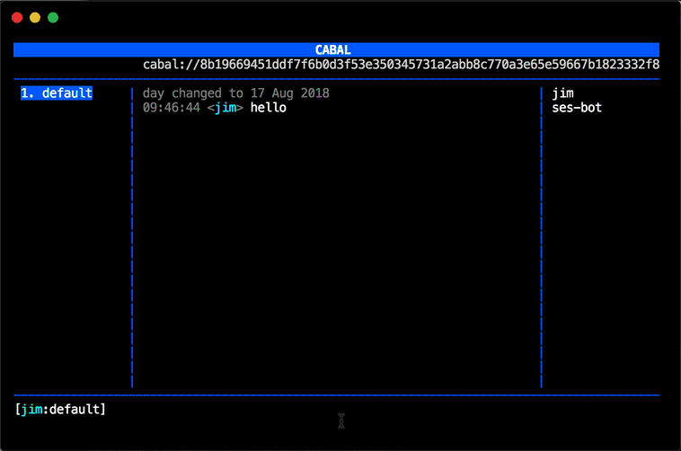

cabal-ses-bot
=============

A bot hosting daemon for [cabal](https://cabal-club.github.io/), an experimental p2p community chat platform.

Uses "[Secure Ecmascript](https://github.com/Agoric/SES)" so that participants in the cabal chat can create their own bots ... the code is "untrusted" and runs in a sandbox.



## "Secure Ecmascript" and "Frozen Realms"

I was inspired to write this after seeing Brian Warner's talk titled "[Fearless Cooperation: Giving eval() to your worst enemy for fun and profit](https://decentralizedwebsummit2018.sched.com/event/FgXN/talk-fearless-cooperation-giving-eval-to-your-worst-enemy-for-fun-and-profit)" at the 2018 Distributed Web Summit in San Francisco.

* [Video on archive.org (starts at 51:15)](https://archive.org/details/decentralizedwebsummitmedia-2018-loglounge-2/DWeb+Log+Lounge+080218+02.mov?start=3075)
* [Slides with code samples](https://agoric.com/assets/pdf/FearlessCooperation-SES-BrianWarner-Agoric-DWeb2018.pdf)
* [Agoric's announcement of SES](https://agoric.com/agoric-releases-ses/)

There is more than a decade of research into how to sandbox Javascript. For more background on the "Frozen Realms" proposal for Ecmascript, check out:

* Github: [tc39/proposal-frozen-realms](https://github.com/tc39/proposal-frozen-realms)
* Video: [Frozen Realms: Draft Standard Support for Safer JavaScript Plugins](https://www.youtube.com/watch?v=tuMG7688Ndw) - Mark Miller explains how sandboxing works

This is an experiment in using some pretty cutting edge security sandboxing technology,
so be careful with it. I may have made mistakes and the core security technology is really
new.

## Using it

First, install [cabal](https://cabal-club.github.io/) and start up a new cabal instance, eg:

```
cabal --db ./db
```

You can use an existing cabal, but make sure the owner of the cabal is okay with you running bots there.

Then clone this repo, do an `npm install`, and run it with the following arguments:

```
node -r esm index --key <cabal hex key> --dir ~/.cabal-ses-bot/dev --nick ses-bot
```

It should connect to your cabal using the nickname 'ses-bot' for the master control bot.

## Commands

Assuming you named your master control bot "ses-bot", you can send it the following commands:

* `ses-bot help`

  Displays list of commands.

  ```
  13:08:22 <jim> ses-bot help
  13:08:22 <ses-bot> Supported commands:
  13:08:22 <ses-bot>
  13:08:22 <ses-bot>   * help
  13:08:22 <ses-bot>   * register <nick> <dat url>
  13:08:23 <ses-bot>   * ps
  13:08:23 <ses-bot>   * kill <pid>
  13:08:23 <ses-bot>   * killall
  13:08:23 <ses-bot>   * resurrect <pid>
  13:08:23 <ses-bot>   * update <pid>
  ```

* `ses-bot register <nick> <dat url>`

  Creates a new bot. It is attached to the 'nick' provided. The javascript file hosted at the dat://... url will be loaded and used as the message handler for the bot. You can use [Beaker Browser](https://beakerbrowser.com/) to host and create dat urls and you can even edit the files in the browser. Alternatively, you can use the [dat cli](https://github.com/datproject/dat) to upload/host your bot scripts.

  ```
  13:22:04 <jim> ses-bot register echo-bot dat://9bfa25a2edf2c1d9ca6b800acfbb5d100f4488e50798a78300d1b352427f9897/echo-bot.js
  13:22:04 <ses-bot> Bot registered at PID 1
  ```

* `ses-bot ps`

  Displays list of bot processes.

  ```
  13:09:59 <jim> ses-bot ps
  13:09:59 <ses-bot> PID: 0 ses-bot
  13:09:59 <ses-bot> PID: 1 echo-bot
  13:10:00 <ses-bot> PID: 2 counter-bot
  ```

* `ses-bot kill <pid>`

  "Kills" a bot. Bots don't really run continuously, so this is really just disconnecting it from incoming messages.

  ```
  13:23:17 <jim> ses-bot kill 1
  13:23:17 <ses-bot> Killed PID 1
  ```

* `ses-bot killall`

  "Kills" all the bots. Use this if the bots
  are misbehaving.

  ```
  13:25:32 <jim> ses-bot killall
  13:25:32 <ses-bot> Killed PIDs: 1 2
  ```

* `ses-bot resurrect <pid>`

  "Unkills" a bot.

  ```
  13:28:42 <jim> ses-bot resurrect 1
  13:28:42 <ses-bot> Resurrected PID 1
  ```

* `ses-bot update <pid>`

  Reloads the bot handler from the dat url it was originally loaded from. Useful if you are doing development.

  ```
  13:31:02 <jim> ses-bot update 1
  13:31:02 <ses-bot> Updated PID 1
  ```

## Sample bots

The 'sample-bots' directory in the source provide source for two simple bots:

* [echo-bot.js](https://github.com/jimpick/cabal-ses-bot/blob/master/sample-bots/echo-bot.js)

  Simply echos back whatever a user sends to it.

  ```
  13:33:37 <jim> echo-bot hello
  13:33:37 <echo-bot> jim: Echo "hello"
  ```

* [counter-bot.js](https://github.com/jimpick/cabal-ses-bot/blob/master/sample-bots/counter-bot.js)

  Demonstrates using "state". Keeps track of an integer counter that anybody can increment or decrement.

  ```
  13:35:15 <jim> counter-bot help
  13:35:15 <counter-bot> Supported commands: "incr", "decr"
  13:35:19 <jim> counter-bot incr
  13:35:19 <counter-bot> Incremented => 1
  13:35:20 <jim> counter-bot incr
  13:35:20 <counter-bot> Incremented => 2
  13:35:24 <jim> counter-bot decr
  13:35:24 <counter-bot> Decremented => 1
  ```

## Bot API

There isn't much of an API yet. Let's look at the source from [echo-bot.js](https://github.com/jimpick/cabal-ses-bot/blob/master/sample-bots/echo-bot.js). Each bot just exports a default function that will receive every message posted into the cabal chat (from all users, for every channel):

```js
module.exports = handleMessage

async function handleMessage (botName, message, state, refs) {
  const {channel, content, author} = message

  // ... bot logic here
}
```

Normally, you'll want to only respond to messages directed at the registered name of the bot:

```js
const regex = new RegExp(`^${botName}[ :] *(.*)$`)
const match = content.match(regex)
if (!match) return
```

You can log output for debugging which will show up on the console of the bot daemon:

```js
console.log(`Message: (${channel}) ${author}: "${content}"`)
```

(Pro-tip: Run the daemon with `DEBUG=ses-bot` for verbose debug output)

There is a `chat.send()` global object and method for sending messages back:

```js
const rest = match[1]
  chat.send({
    channel,
    message: `${author}: Echo "${rest}"`
  })
```

For a slightly more advanced example, look at the source from [counter-bot.js](https://github.com/jimpick/cabal-ses-bot/blob/master/sample-bots/counter-bot.js) to see how you can read state from the `state` argument, and save state using the `setState()` global method. The state is persisted to a JSON file on disk after each invocation so it won't be lost when the daemon is restarted.

There is also a `refs` and `setRefs()` object for saving objects that won't be saved to JSON. These will be lost when the daemon is restarted.

## Video demo

<video src="https://cabal-ses-bot-video.hashbase.io/cabal-ses-bot.mp4" controls></video>

## Ideas for the future

- [ ] Bots can create/publish their own Dat archives
- [ ] Bots can download Dat archives from swarm
- [ ] Bots can subscribe to changes on a Dat archive
- [ ] IPFS
- [ ] SSB
- [ ] More sample bots, eg. Eliza, polls, etc.
- [ ] Resource limits
- [ ] Access control
- [ ] Modular endowment mixins

## License

MIT
